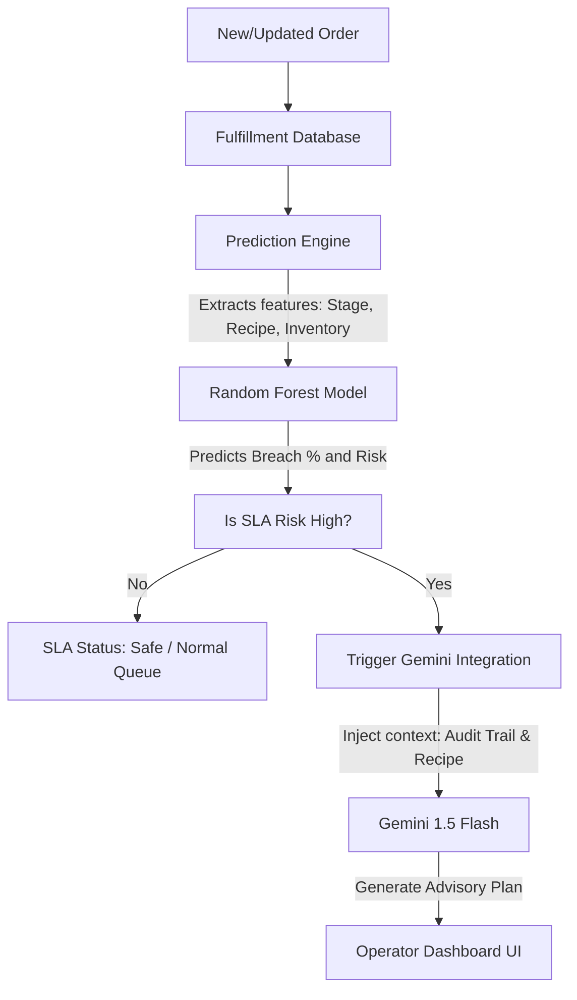

# 1-Page Architecture Note: AI Models & APIs

This document outlines the artificial intelligence models and APIs integrated into the **Eluno Eyewear Order Management System (OMS)** backend to enable predictive risk mitigation and automated troubleshooting.

---

## 1. Google Gemini 1.5 Flash API
* **Model Used:** `gemini-1.5-flash` (via the `google-generativeai` SDK)
* **Integration Location:** [gemini_integration.py](file:///c:/Users/RAGAVENDRA/Desktop/project/backend/services/gemini_integration.py)
* **Role in Application:** 
  Generates personalized, context-aware production mitigation advisory plans for lens orders flagging high SLA breach risk. It performs a four-part response structure:
  1. **Root Cause Diagnosis:** Analyzes why the order is stuck (e.g., custom curve customization combined with out-of-stock blanks).
  2. **Immediate Production Remediation:** Instructions for the lab tech (spherical adjustments, machine queuing, etc.).
  3. **Inventory Workaround:** Material reallocation or lab rerouting instructions.
  4. **Customer Communication:** A draft email/SMS explaining the delay in a reassuring, craftsmanship-focused tone.
* **Why Chosen:** 
  * **Low Latency & Cost-Efficiency:** Ideal for processing real-time order logs.
  * **Instruction Following:** Perfect for generating deterministic markdown-structured outputs matching exact header templates.
  * **High Context Window:** Easily accommodates entire multi-stage audit trails and order histories.

---

## 2. Tabular Prediction Engine (Random Forest Classifier)
* **Model Used:** Random Forest Classifier (serialized as [order_breach_model (1).pkl](file:///c:/Users/RAGAVENDRA/Desktop/project/order_breach_model%20(1).pkl))
* **Integration Location:** [prediction_engine.py](file:///c:/Users/RAGAVENDRA/Desktop/project/backend/services/prediction_engine.py)
* **Role in Application:** 
  Calculates the probability of an SLA breach (0–100%) and categorizes the order into a Risk Level (Low, Medium, High) based on real-time features:
  * Lens Type (e.g., Single Vision, Bifocal, Progressive)
  * Prescription Severity (Sphere/Cylinder diopter ratings)
  * Active Stage & Elapsed Hours
  * Inventory Stock Status
  * Logged holds or active machine delays
* **Why Chosen:**
  * **Tabular Optimization:** Random Forest is excellent for tabular database inputs with a mix of numerical features (diopter values, elapsed hours) and categorical features (lenses, stages).
  * **CPU Inference:** Instant sub-millisecond local predictions without network latency or external API costs.
  * **Interpretability:** Provides clear feature importances (e.g., Logged Stage Hold has 42% importance, Elapsed Hours has 25% importance), allowing the application to output rule-based explanations for its predictions.

---

## Architectural Flow

